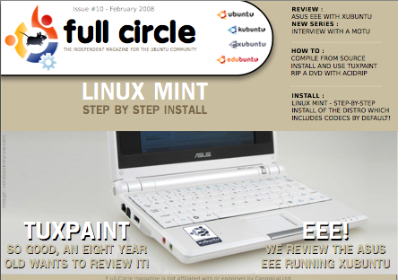

[]()

E' appena stato rilasciato il **numero 10** di [**Full Circle Magazine**](http://fullcirclemagazine.org), la rivista
elettronica gratuita dedicata a **Linux** e ad **Ubuntu** in generale.

In questo numero:

- Installazione di Linux Mint
- HowTo: installare un programma da sorgenti, utilizzare TuxPaint,
rippare un DVD con AcidRip, creare il proprio server (parte 2)```

- Recensione dell'Asus EeePc con eeeXubuntu
- Lettere, domande & risposte, ecc...

La rivista è interamente in inglese e potete scaricarla da questo
indirizzo: [**http://fullcirclemagazine.org/issue-10/**](http://fullcirclemagazine.org/issue-10/)

