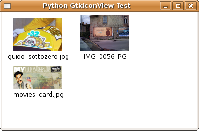

In these days I was looking for a simple tutorial to understand how to
use **GtkIconView**, but the only thing I was able to find was an
example in PHP-Gtk. So I decided to translate it in **Python** language,
thinking it would be useful for other people trying to use that Gtk
control. You can find the code here:

```python
import gtk
import gobject

DEFAULT_IMAGE_WIDTH = 100

# Main Window setup  
window = gtk.Window(gtk.WINDOW_TOPLEVEL)
window.set_size_request(400, 240)
window.connect("destroy", gtk.main_quit)
window.set_title("Python GtkIconView Test")

# Add a VBox  
vbox = gtk.VBox()  
window.add(vbox)

# Setup Scrolled Window  
scrolled_win = gtk.ScrolledWindow()
scrolled_win.set_policy(gtk.POLICY_AUTOMATIC, gtk.POLICY_AUTOMATIC)

# Setup ListStore to contain images and description  
model = gtk.ListStore(gtk.gdk.Pixbuf, gobject.TYPE_STRING)

# Create a tuple with image files
immagini = (
    "BD786-TFR.jpg", "guido_sottozero.jpg", "IMG_0056.JPG", "movies_card.jpg"
)

for im in immagini:
    try:  
        pixbuf = gtk.gdk.pixbuf_new_from_file(im)
        pix_w = pixbuf.get_width()
        pix_h = pixbuf.get_height()
        new_h = (pix_h * DEFAULT_IMAGE_WIDTH) / pix_w # Calculate the scaled height before resizing image
        scaled_pix = pixbuf.scale_simple(
            DEFAULT_IMAGE_WIDTH, new_h, gtk.gdk.INTERP_TILES
        )
        model.append((scaled_pix, im))
    except:
        pass

# Setup GtkIconView  
view = gtk.IconView(model)  # Pass the model stored in a ListStore to the GtkIconView
view.set_pixbuf_column(0)
view.set_text_column(1)
view.set_selection_mode(gtk.SELECTION_MULTIPLE)
view.set_columns(0)
view.set_item_width(150)

# Pack objects and show them all  
scrolled_win.add(view)  
vbox.pack_start(scrolled_win)
window.show_all()

gtk.main()
```

The important thing to notice is that you have to store all the images
in a **GtkListStore** and pass it to the **GtkIconView** as *"model"*
parameter. I hope this example is clear. If you have any question,
please comment this post and I'll try to answer.

This is a screenshot of this example:

[]()

