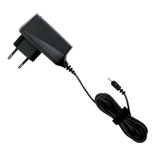

Secondo quanto dichiarato da **Nokia** (che negli ultimi device usciti
addirittura visualizza un messaggio di avviso sul display quando il
dispositivo è completamente carico), è stato calcolato che se anche solo
tutti gli utenti Nokia scollegassero i loro carica batterie quando la
carica è completata, si potrebbe risparmiare **energia per alimentare
circa 100.000** case di media dimensione in tutta Europa.

Quando si lascia il carica batterie inserito nella presa di casa
infatti, viene **ugualmente consumata** una certa quantità di energia
che noi riteniamo irrilevante o addirittura non esistente. A leggere i
dati di Nokia non è così.

Questo ovviamente non vale soltanto per i loro carica batterie, ma anche
per quelli dei cellulari di altre marche. Se vogliamo dare il nostro
piccolo contributo per il risparmio energetico mondiale, tutto quello
che dobbiamo fare è **scollegare il carica batterie** dalla parete una
volta che abbiamo finito di ricaricare il cellulare.

