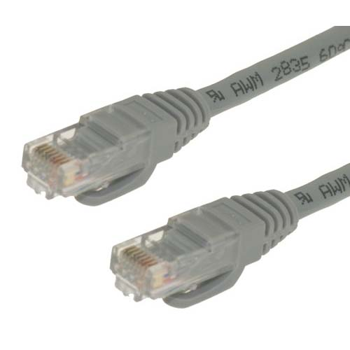

Secondo quanto [riportato sulla mailing list](https://lists.ubuntu.com/archives/ubuntu-devel-announce/2008-September/000488.html)
di sviluppo di Ubuntu, un **bug** presente nella versione **2.6.27** del
**kernel Linux** potrebbe **danneggiare irreparabilmente** le schede
ethernet dotate di chipset **Intel GigE** che utilizzano il driver
**e1000e**.

Secondo le prime analisi, il bug andrebbe a sovrascrivere la eprom di
queste schede di rete, rendendole inutilizzabili.

L'attuale alpha 6 di Ubuntu contiene questo bug, si consiglia quindi di
non utilizzarla se si possiede tale scheda, ma di attendere almeno la
prossima release (la beta dovrebbe uscire il 2 ottobre), dove il bug è
già stato corretto.

