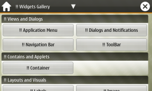
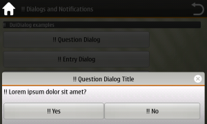
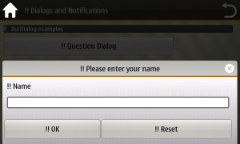
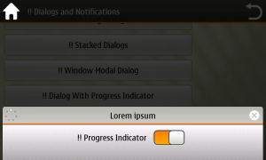
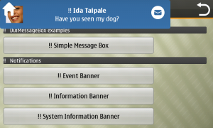
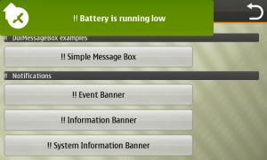

Nokia has published a demo application for **N900**, available in
**extras-devel** repository, that shows a preview of **Maemo 6**
(Harmattan) user interface. Here there are some screenshots of the
demo:  

Demo application main window

Question dialog

Text entry dialog

Progress indicator

Information banner

Event banner

Please note that installing this demo will also install **Qt 4.6.2** on the N900 and about **52 Mb** are required.

