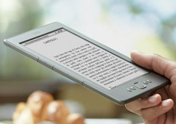

[{ width=60% }](kindle-300x211.jpg)

In questo periodo diversi conoscenti mi stanno facendo domande su come
siano gli ebook e se valga la pena farne uso rispetto ai normali libri
cartacei. Recentemente ho avuto modo di acquistare il lettore
**[Kindle](http://www.amazon.it/Kindle-dispositivo-wireless-inchiostro-elettronico/dp/B0051QVF7A/ref=amb_link_162561647_2?pf_rd_m=A11IL2PNWYJU7H&pf_rd_s=center-1&pf_rd_r=0DNDRW6Q67KH6PZGYECK&pf_rd_t=101&pf_rd_p=270371827&pf_rd_i=426865031)**
di **Amazon** e devo ammettere di essere rimasto molto soddisfatto. Ho
cercato di raccogliere le principali domande che mi sono state fatte al
riguardo, sperando di fornire una panoramica completa sui libri in
formato elettronico e sui relativi lettori.

**Non è scomodo leggere sul Kindke?** Assolutamente no. Non dovete
immaginare il Kindle come un tablet (anzi, chi cerca un qualcosa che
funzioni anche come tablet ha proprio sbagliato prodotto. Kindle è fatto
per leggere libri.), lo schermo infatti non è un normale LCD come quelli
dei tablet o dei portatili, ma una speciale superficie dove le parole
vengono disegnate tramite l'[e-ink](http://it.wikipedia.org/wiki/E-ink).
Lo schermo del Kindle non è retroilluminato e per leggere, così come per
un libro normale, c'è bisogno o della luce del sole o di stare vicino ad
una lampada. Gli occhi quindi non si stancano ed è possibile andare
avanti a leggere per ore, senza notare differenze rispetto alla lettura
di un libro normale.

**Quanto costano i libri in formato elettronico?** Di solito il costo è
di **3-4€ in meno** rispetto alla versione cartacea. Potrebbero costare
molto meno se la legge italiana (ancora una volta cieca di fronte alle
innovazioni) non equiparasse gli ebook a dei prodotti elettronici. L'IVA
sugli ebook è infatti del 21% e non viene assolta come per i libri
cartacei. Va detto anche che moltissimi libri, per i quali sono ormai
scaduti i diritti di autore, sono disponibili gratuitamente. Volete
leggere *La Divina Commedia*, *Pirandello*, *I Promessi Sposi* ecc...?!
Benissimo. Questi e molti altri libri sono scaricabili gratuitamente.
Kindle al momento offre "soltanto" **16.000 titoli** in italiano, ma è
ovviamente possibile accedere anche a tutti gli altri titoli disponibili
in lingua straniera, per un totale di **quasi un milione di libri a
disposizione**.

**Quali sono i vantaggi per chi scrive?** Gli scrittori, grazie agli
ebook, hanno un modo ancora piu' facile e redditizio per pubblicare i
propri libri. Attualmente, se uno scrittore vuole pubblicare un libro,
deve trovare un editore che lo reputi interessante e decida di investire
per pubblicarlo. Visto che l'editore di assume un rischio molto alto, la
maggior parte del compenso va a lui. Con Amazon invece è possibile
pubblicare un proprio libro in modo economico e veloce. Non c'è
necessità di stampare migliaia di copie di un libro, così come avviene
per il cartaceo. I compensi inoltre sono molto alti: il **70% del
ricavato va a chi scrive il libro**, non all'editore. Su un libro da 10€
quindi, all'autore rimangono 7€.

**Riassumiamo i vantaggi degli ebook**

- economici (costano 3-4€ in meno, molti sono persino gratuiti)
- ecologici (non c'è bisogno di stampare migliaia di copie)
- maggiori introiti per chi scrive i libri
- un e-reader è leggero, può contenere oltre 1000 libri, ottima autonomia con batterie che durano 1 mese
- comodità di poter acquistare un libro direttamente da casa ed averlo in pochi minuti
- nessun pericolo di acquistare un libro che non ci piace: con Kindle è possibile avere una copia dei primi capitoli del libro, senza spendere niente, in modo da valutare se il libro valga veramente la pena di essere letto

Se posso aggiungere un vantaggio, del tutto soggettivo, ma che
personalmente è il piu' importante: gli ebook mi hanno fatto tornare
anche la voglia di leggere!

