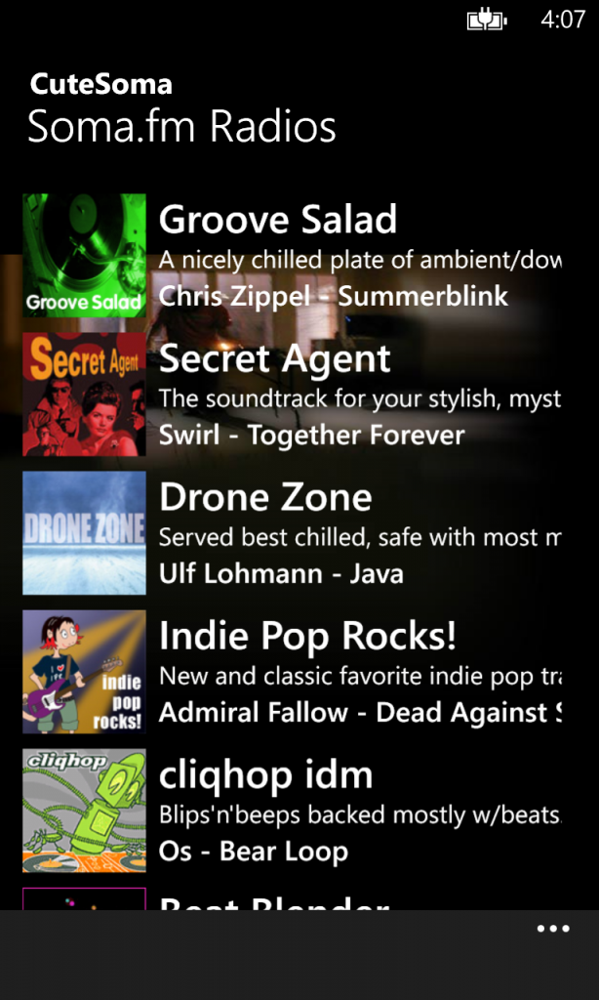
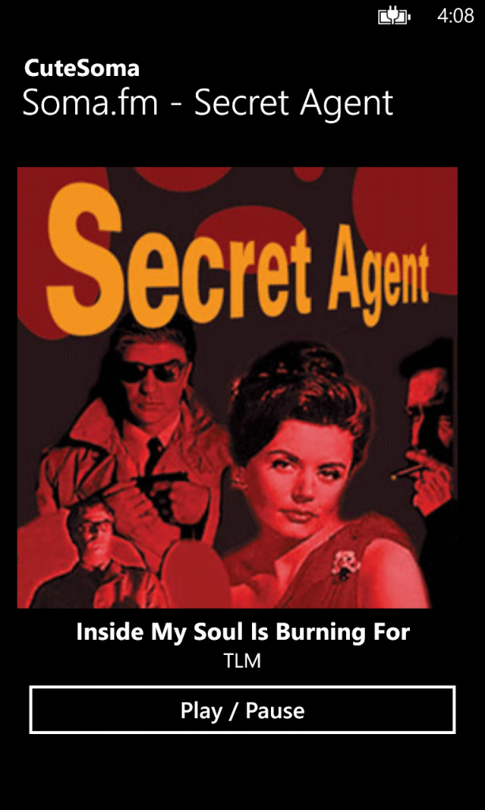
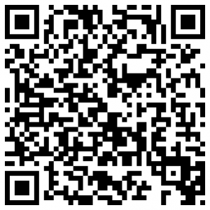

It's a pleasure for me to announce the first public release of
[**CuteSoma**](http://www.windowsphone.com/s?appid=387185ca-1328-4d1c-a4c2-45568cf06470)
for **Windows Phone** (WP7 and WP8). CuteSoma is a mobile client for the
amazing [**Soma.fm**](http://somafm.com) radio a listener-supported,
commercial-free, underground, alternative radio broadcasting over 20
unique channels from San Francisco. This is my first application for WP
platform, and unlike the N9 version that was completly free of charge,
I've decided to release this version in two ways: a free trial version
with just 3 (and other 3 coming with the next imminent upgrade) radio
channels available and a full version with all Soma.fm channels for just
0.99 €. I don't think it's too expensive, right? Consider all the time
I've spent coding it and if you like the trial version, please support
the development of this application and purchase the full one.

[{ width=30% }](CuteSomaWP_main_WXGA-614x1024.png)
[{ width=30% }](CuteSomaWP_main_WXGA.png)

## Install CuteSoma

1. Press **Search** button on your Nokia Lumia (or any other Windows
Phone) and tap **vision** button

2. Scan the following QrCode

[{ width=30% }](CuteSomaWP_QrCode.png)

3. Tap on the link when it appears on the screen
4. Install the application from the Windows Phone Store
5. Enjoy!

Please consider also [**donating**](http://somafm.com/support/)to
Soma.fm if you like their music: Soma.fm is donation supported and they
need your "love" to pay their bills :)

