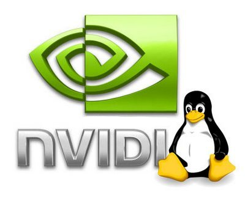

[](logo_nvidia_linux.jpg)

After upgrading my desktop PC to **Ubuntu 12.04** (actually my main
machine) I started experimenting many **Xorg crashes** and instability
issues. I [reported the
bug](https://bugs.launchpad.net/ubuntu/+source/nvidia-graphics-drivers/+bug/986445),
but I had to find a solution or I should have rolled back to Ubuntu
11.10. The problem (from my point of view) is of the new **Nvidia
295.40** binary drivers. I also tried an older version (295.33)
experiencing the same problems. I then decided to give the
**[Nouveau](http://nouveau.freedesktop.org)** opensource drivers a try.

I must say that in over 24 hours I didn't have a single Xorg crash. My
desktop is very stable and Nouveau drivers are pretty fast: I can watch
a 1080p video on Youtube in full screen without having any problem. The
only problem with my machine is that I'm using a VGA Switcher to share
my monitor wit Xbox (see [this old
post]({filename}/2012/6-sharing-your-pc-monitor-with-your-xbox-using-a-vga-switcher.md)),
so my monitor capabilities cannot be detected automatically and I had to
do some manually tuning of the Xorg configuration.

First of all I had to resolve a very annoying problem: the screen was
blinking every 10 seconds and this really hurted my eyes. To fix this I
had to add a kernel parameter: **drm\_kms\_helper.poll=0  
**you need to add this string in **`/etc/default/grub`** to
the **`GRUB_CMDLINE_LINUX_DEFAULT`** parameter. After this your line
should look like this one: **`GRUB_CMDLINE_LINUX_DEFAULT="quiet splash drm_kms_helper.poll=0"`**

Don't forget to execute: **`sudo update-grub`** from the command line.

Then I had to create a proper **xorg.conf** setting my resolution
(1680x1050) manually:

```bash
Section "Monitor"  
Identifier "DVI-I-1"  
VendorName "Asus"  
ModelName "Ancor Communications Inc VW222"  
Modeline "1680x1050R" 119.00 1680 1728 1760 1840 1050 1053 1059 1080
+hsync -vsync  
Option "PreferredMode" "1680x1050R"  
EndSection

Section "Screen"  
Identifier "Screen0"  
Monitor "DVI-I-1"  
EndSection
```

How do you generate the **Modeline** line? It's very simple. Just
execute: "**cvt -r 1680 1050**" in the command line and you'll get a
line similar to the one I added (of course substitute those numbers with
the resolution you want).

You have to save this file in **/etc/X11/xorg.conf** and reboot your
system to use all the new settings. Now my system runs nicely and very
fast! I'm really enjoying the new **Ubuntu 12.04 Precise Pangolin**. I
just hope that Nvidia guys will fix the sta  
bility issues of their driver as soon as possible, so I'll be able to
choose again between the opensource driver and the closed source one
(faster with 3D stuff, but more unstable as you can see).

A big **thanks** to everyone in **\#nouveau** **IRC** channel on
**Freenode**. They were very kind to help me configuring their
opensource driver.

