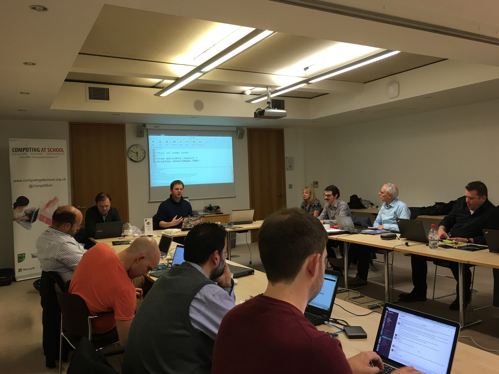
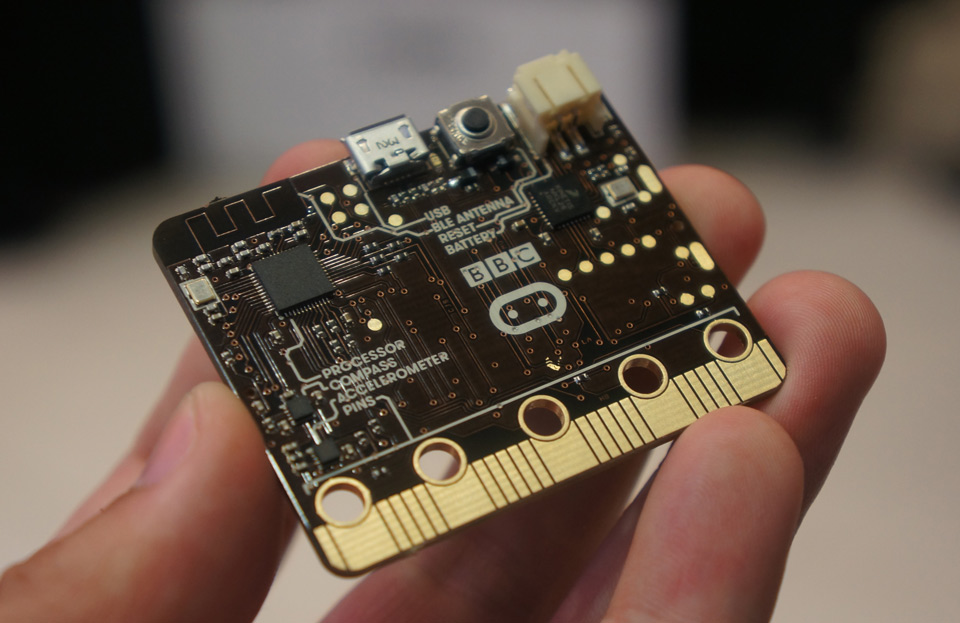

A few days ago I had the great opportunity to attend an event organised
in collaboration with **[Python Software
Foundation](https://www.python.org/)**, a few **primary school
teachers** and hosted by **[Computing at
School](http://www.computingatschool.org.uk/)**, in **London**. The
meeting was organised by **Yvonne Walker** (from CAS) and **Nicholas
Tollervey** (PSF). The aim of the meeting was for teachers and
developers to meet and discuss the opportunities offered
by **[MicroPython](https://micropython.org/)** on the **[BBC
micro:bit](https://www.microbit.co.uk/)**. During the event a
**BBC** **micro:bit** board was loaned to each person for the purpose of
developing Python scripts, MicroPython itself or educational resources
for the **BBC micro:bit**. Nicholas made it very clear that there is an
**NDA** in place until the device is delivered to the kids and explained
what we could or couldn't do.

[{width=100%}](computing_at_school_microbit_reduced.jpg)

## The Board

[{width=100%}](bbcfullbleed.jpg)

The board is a 4 x 5 cm device with an **ARM Cortex-M0** processor,
**accelerometer** and magnetometer sensors, **Bluetooth** and **USB
connectivity**, a **display** consisting of 25 LEDs, **two programmable
buttons**, and can be powered by either USB or an external battery pack
(source: <https://en.wikipedia.org/wiki/Micro_Bit> ).

## Flashing the firmware

Once you get a new board, it probably doesn't have a proper firmware and
application flashed. I suggest you to download the **Python MicroBit
REPL** from this repository: <https://github.com/ntoll/microrepl>  
All you need to do is to connect the board to your computer, using a
**micro-USB cable**. The device will be mounted as a volume. At this
point, drag & drop the file called
**[firmware.hex](https://github.com/ntoll/microrepl/blob/master/firmware.hex)**
into the mounted volume. The firmware will be flashed and during the
operation you will see a yellow led flashing.

## Using MicroPython micro:bit REPL

To start writing some Python code on micro:bit you first need to clone
this [repository](https://github.com/ntoll/microrepl)

```shell
git clone git@github.com:ntoll/microrepl.git
```

once you have cloned the repository, you need to install the Python
dependencies (I suggest you to do it from inside a **virtualenv**)

```shell
pip install -r requirements.txt
```

start the MicroPython REPL

```shell
python microrepl.py
```

and the Python shell will open, so you can start writing commands, like
this one

```shell
(microbit)➜  microrepl git:(master) python microrepl.py
Quit: Ctrl+] | Stop program: Ctrl+C | Reset: Ctrl+D
Type 'help()' (without the quotes) then press ENTER.

>>> import this
The Zen of MicroPython, by Nicholas H.Tollervey

Code,
Hack it,
Less is more,
Keep it simple,
Small is beautiful,

Be brave! Break things! Learn and have fun!
Express yourself with MicroPython.

Happy hacking! :-)
>>>
```

## BBC micro:bit MicroPython Editor

Typing all the Python commands directly into the shell can be a bit
difficult. You can use a very nice and dedicated editor to write code
and produce the compiled application for the micro:bit. All you need to
do is clone this [repository](https://github.com/ntoll/upyed)

```shell
git clone git@github.com:ntoll/upyed.git
```

Open the file named **editor.html** with your browser and start writing
your code. When your code is done, you can generate the **.hex** file
clicking on **Download** button. To load the compiled application you
just need to drag & drop the .hex file to the mounted device, exactly
like you did the first time to flash it. If you need a reference for all
the methods and libraries available, you can consult the official
documentation
here <http://microbit-micropython.readthedocs.org/en/latest/index.html>

## References

- <https://github.com/ntoll/microrepl>
- <https://github.com/ntoll/upyed>
- <https://www.microbit.co.uk/>
- <http://microbit-micropython.readthedocs.org/en/latest/index.html>

