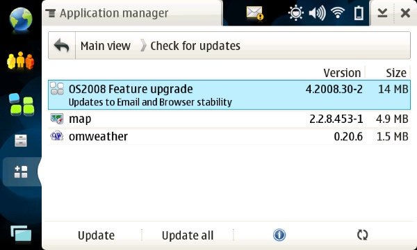

A new update for **Nokia Os 2008** is available for **Nokia N810** (and I suppose N800
too).

All you have to do is connect to Internet, refresh package list and
install the updates.

The main application that have been updated are **Mail client** and
**web browser**. **Map application** has been updated too.

The total size to download is about **19 Mb** and for the first time, no
re-flash is required to update N810 firmware. At the end of the
installation you're only required to restart the device.

**N.B:** be sure to have at least 19Mb free on the device, else the
upgrade will fail.

