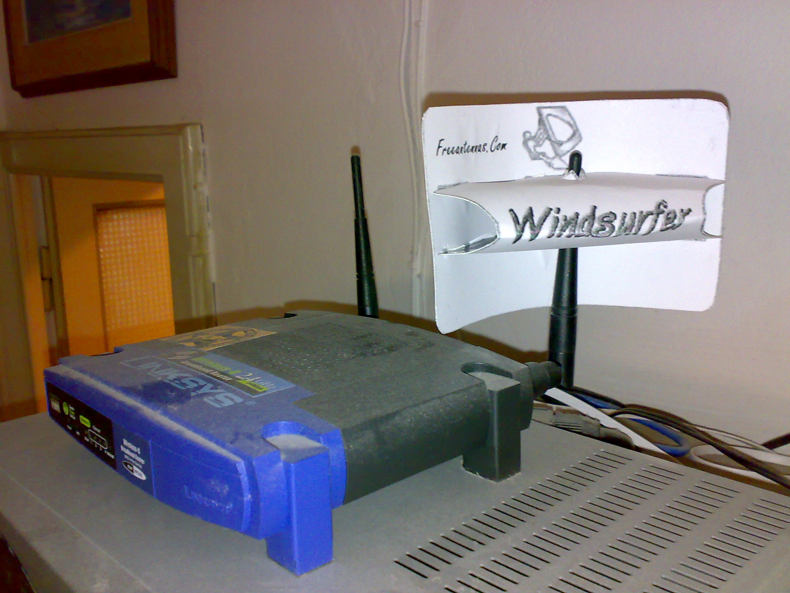

Dopo averne sentito tanto parlare, senza mai aver avuto occasione di provarla
direttamente, mi sono deciso a costruire una **mini antenna parabolica**
per **potenziare il segnale** del router **wireless**.

Dalle poche prove che ho potuto fare, in effetti il segnale viene
potenziato abbastanza. Ad esempio ricercando le reti wireless con il
palmare da camera mia al salotto, il segnale del router era di circa
metà. Avendo messo l'antenna nuova il segnale è quasi pieno!

Consiglio a tutti di provare questa soluzione, **potrebbe potenziare
molto il vostro segnale wireless** e permettervi di avere un segnale
molto piu' stabile in qualsiasi punto della casa.

