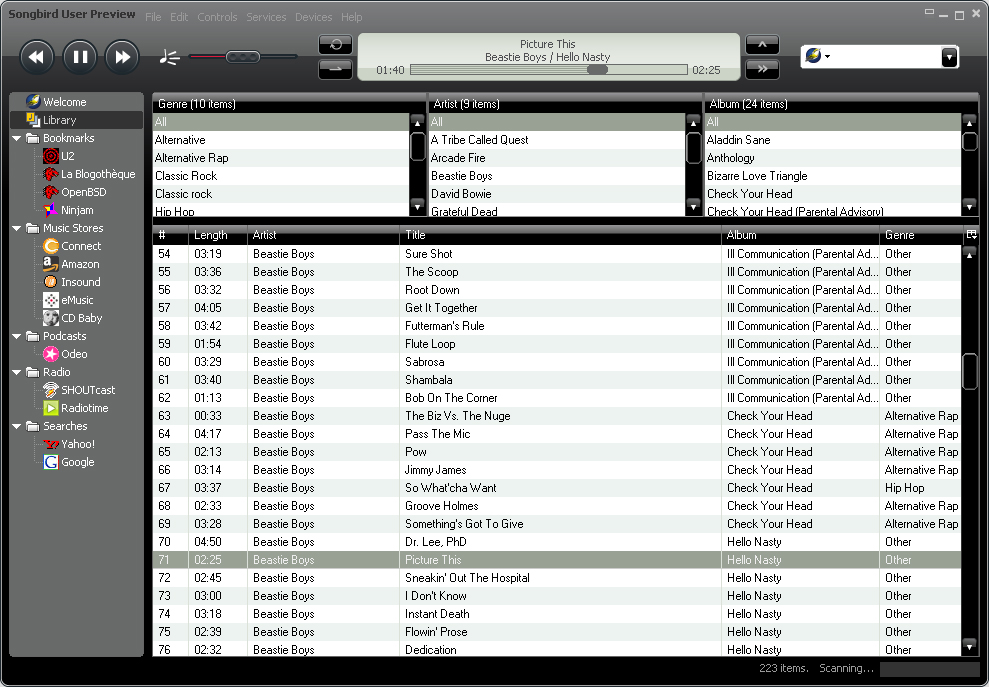

Se si prova a far girare la versione di **Songbird** scaricabile [dal sito
ufficiale](http://getsongbird.com) su **Ubuntu** (ma il problema sembra
riguardare anche altre distribuzioni visto che si tratta di un bug del
driver Nvidia) si otterrà quasi sicuramente un crash dell'applicazione
stessa.

Per risolvere il problema è sufficiente disinstallare un plugin
(**libvisual-0.4-plugins**) utilizzando il seguente comando: **sudo
apt-get remove **libvisual-0.4-plugins****

Una nota negativa: questo bug è presente fin dalla versione 8.10 di
Ubuntu... che aspettano a correggerlo invece di far ricorrere gli utenti
a questi trucchetti?

