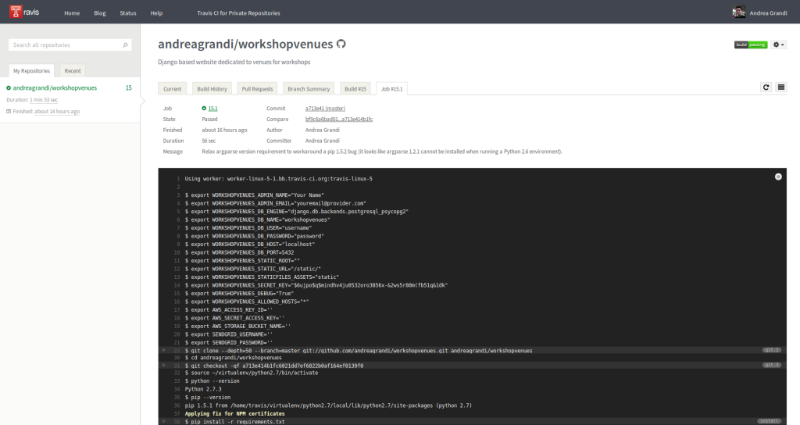

Developing a large web application or before deploying some code is very
important to verify the quality of the code itself, check if we have
introduced any regression or bug and have something that tell us if we
are increasing or decreasing the quality of the code.

Suppose we are in an organization or a company where the basic rule is:
**master** branch is always ready/stable to be deployed. In a team
usually people work on personal branches, then when the code is stable
it's merged with master.

How do we check if the code is stable and ready to be merged? First of
all we need to cover all our code with **proper tests** (I won't go in
details about unit testing here, I assume that the reader knows what I'm
talking about), then we need to actually run them, possibly in an
isolated environment that is similar to the production one, and check if
they all pass. If they do, we are quite safe to merge our code with
master branch.

How can we ensure that all the developers remember to run tests when
they push some new code? To make things a bit more real, let's take the
example of a Python/Django product (or even a library) that currently
supports **Python 2.6, 2.7, 3.3** and **Django 1.4.x, 1.5.x, 1.6.x**.
The whole matrix consists of **9 possible combinations**. Do we have to
manually run tests on 9 configurations? No, we don't.

## Travis-ci.org

**Travis** is a continuous integration tool that, once configured, takes
care of these tasks and let us save lot of time (that we can use to
actually write code). [Travis-ci.org](https://travis-ci.org) is an
online service that works with [**GitHub**](https://github.com) (it
requires we use GitHub as repository for our code), and once we have
connected the two accounts and configured a very simple file in our
projects, it's automatically triggered when we push on our GitHub
repository.

The configuration consists of adding a file named **.travis.yml** in the
root of our project. A working example is available here
<https://github.com/andreagrandi/workshopvenues/blob/master/.travis.yml>
(all the env variables I set are not required normally, but that's where
I save the values of my configuration, so they need to be initialized
before I can run tests).

The service supports most of the languages that are commonly used and
even a good number of PAAS, making it very easy to automatically
**deploy** our code. If it should not be enough for your needs, they
also expose a public **API**. I suggest you to give a look at the
official documentation that will explain everything in details
<http://docs.travis-ci.com>

Once everything is configured, we will have something like this on our
console
<https://travis-ci.org/andreagrandi/workshopvenues/jobs/19882128>

[{ width=90% }](travis-ci-console.png)

If something goes wrong (if tests don't pass for example) we receive a
notification with all the informations about the failing build, and if
we had configured an automatic deployment of course the code would not
be deployed in case of a failing build.

Travis-ci.org is **completly free** for opensource projects and has also
a paid version for private repositories.

## Coveralls.io

There is a nice tool available for Python called
[**coverage**](http://nedbatchelder.com/code/coverage). Basically it
runs tests and checks the percentage of the source code that is covered
by tests, producing a nice report that shows us the percentage for every
single file/module and even the lines of code that have been tested.

Thanks to Coveralls.io and the use of Travis, even these tasks are
completly automatized and the results are available online like in this
example <https://coveralls.io/builds/560853>

The configuration is quite easy. We need to connect our Coveralls.io
profile with GitHub, like we did for Travis-ci.org and then enable the
repository. To trigger Coveralls after a successful Travis build, we
need to have these lines at the end of our **.travis.yml** file

```yaml
after_success:
  - coveralls
```

[{ width=90% }](coveralls-console.png)  
Even Coveralls.io is **completly free** for opensource projects and
offers a paid version for private repositories.

## Heroku

I use [**Heroku**](https://www.heroku.com) to host and run my web
application. Normally to deploy on Heroku you so something like this:
**git push heroku master**

Adding these settings to the **.travis.yaml** file, I can automatically
deploy the application on Heroku, if the build was successful:

```yaml
deploy:
  provider: heroku
  api_key:
    secure: R4LFkVu1/io9wSb/FvVL6UEaKU7Y4vfen/gCDe0OnEwsH+VyOwcT5tyINAg05jWXhRhsgjYT9AuyB84uCuNZg+lO7HwV5Q4WnHo5IVcCrv0PUq/CbRPUS4C2kDD7zbA1ByCd224tcfBmUtu+DPzyouk23oJH+lUwa/FeUk0Yl+I=
  app: workshopvenues
  on:
    repo: andreagrandi/workshopvenues
  run:
    - "python workshopvenues/manage.py syncdb"
    - "python workshopvenues/manage.py migrate"
```

Not only the code is deployed, after deployment the **South migrations** are executed.

## Conclusion

These two tools are saving me lot of time and are ensuring that the code
I release for a project I'm working on
([**WorkshopVenues**](https://github.com/andreagrandi/workshopvenues))
is always tested when I push it on my repository.

