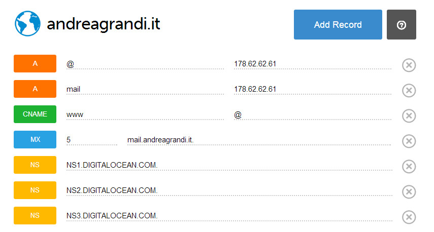

I have recently migrated my website from a shared hosting to a dedicated
VPS on Digital Ocean. Having a VPS surely gives you unlimited
possibilities, compared to a shared hosting, but of course you have to
manage some services by yourself.

In my case I only needed: SSH access, LEMP configuration (Nginx + MySQL
+ PHP) to serve my WordPress blog and Postfix to use email forwarding
from my aliases to my personal email.

## Configuring DNS on Digital Ocean

Understanding how to properly configure the DNS entries in the panel
could be a bit tricky if it's not your daily bread. In particular there
is a Digital Ocean configuration that assumes certain things about your
droplet, so it's better to configure it properly.

For example the droplet name should not be casual, but it should match
your domain name: I initially called my host "andreagrandi" and I had to
rename it to "andreagrandi.it" to have the proper PTR values.

You will need to create at least a "mail" record, pointing to your IP
and an "MX" record pointing to mail.yourdomain.com. (please note the dot
at the end of the domain name). Here is the configuration of my own
droplet (you will notice also a CNAME record. You need it if you want
www.yourdomain.com to correctly point to your ip.

[{ width=100% }](dns_config_digitalocean.jpg)

## Configuring Postfix

In my case I only needed some aliases that I use to forward emails to my
GMail account, so the configuration is quite easy. First you need to
install Postfix:

```shell
sudo apt-get install postfix
```

Then you need to edit** /etc/postfix/main.cf** customizing myhostname
with your domain name and add **virtual\_alias\_maps** and
**virtual\_alias\_domains** parameters. Please also check that
**mynetworks** is configured exactly as I did, or you will make your
mail server vulnerable to spam bots. You can see my complete
configuration here:

<p>
<script src="https://gist.github.com/andreagrandi/fe6246dac228250ee2c0.js"></script>
</p>

## Add your email aliases

Edit **/etc/postfix/virtual** file and add your aliases, one per line,
like in this example:

```shell
info@yourdomain.com youremail@gmail.com
sales@yourdomain.com youremail@gmail.com
```

At this point update the alias map and reload Postfix configuration:

```shell
sudo postmap /etc/postfix/virtual
sudo /etc/init.d/postfix reload
```

## Conclusion

As you can see, configuring Postfix is quite easy, you just need to be
careful when you configure the DNS records in the control panel. Are you
curious to try how Digital Ocean VPS works? Fancy **10\$ credit**
(enough for 2 months if you choose the basic droplet) for **free**? Use
this link and enjoy it
<https://www.digitalocean.com/?refcode=cc8349e328a5>

