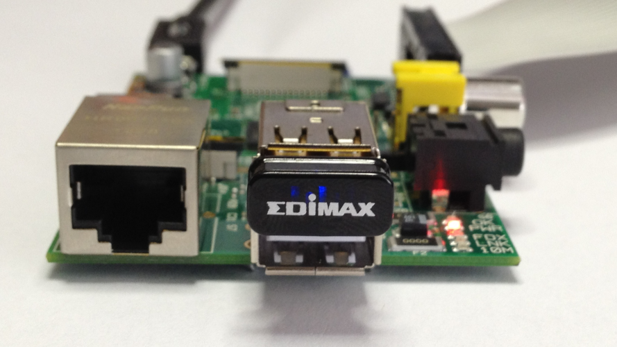

If you want to connect your **RaspberryPi** to your home network and you
want to avoid cables, I suggest you to use the **Edimax wifi adapter**.
This device is quite cheap (around £8 on
[Amazon](http://www.amazon.co.uk/Edimax-EW-7811UN-150Mbps-Wireless-Adapter/dp/B003MTTJOY/))
and it's very easy to configure on Raspbian (I assume you are using a
recent version of Raspbian. I'm using the one released on 20/06/2014).

[{ width=100% }](edimax-pi3.png)

## Configure the wifi adapter

Edit **/etc/network/interfaces** and insert these configuration values:

```shell
auto lo
iface lo inet loopback
iface eth0 inet dhcp

allow-hotplug wlan0
auto wlan0

iface wlan0 inet dhcp
wpa-ssid YOURESSID
wpa-psk YOURWPAPASSWORD
```

## Power management issue

There is a known "issue" with this adapter default configuration that
makes it to turn off if the wlan interface is not in use for some
minutes. To avoid this you have to customize the parameters used to load
the kernel module. First check that your adapter is using **8192cu**
module:

```shell
sudo lsmod | grep 8192
8192cu 551136 0
```

Create the file **/etc/modprobe.d/8192cu.conf** and insert the following
lines inside:

```shell
# prevent power down of wireless when idle
options 8192cu rtw_power_mgnt=0 rtw_enusbss=0
```

I also suggest to create a little entry in crontab to make the
RaspberryPi ping your router every minute. This will ensure that your
wifi connection will stay alive. To edit crontab just type (from pi
user, you don't need to be root):

```shell
crontab -e
```

and insert this line at the end:

```shell
*/1 * * * * ping -c 1 192.168.0.1
```

where 192.168.0.1 is the IP of your router (of course substitute this
value with the ip of your router).

## Keep Alive Script

I created a further script to keep my WIFI alive. This script will ping
the router (change the IP using the one of your router) every 5 minutes
and if the ping fails it brings down the wlan0 interface, the kernel
module for the wifi and bring them up again.

<p>
<script src="https://gist.github.com/andreagrandi/c703e4e67c38fbecf340.js"></script>
</p>
Just put this script in **/root/wifi\_recover.sh** and then execute from
**root** user:

```shell
chmod +x wifi_recover.sh
crontab -e
```

Insert this line inside the crontab editor:

```shell
*/5 * * * * /root/wifi_recover.sh
```

## Conclusion

The configuration is done. Just reboot your RaspberryPi and enjoy your
wifi connection.

