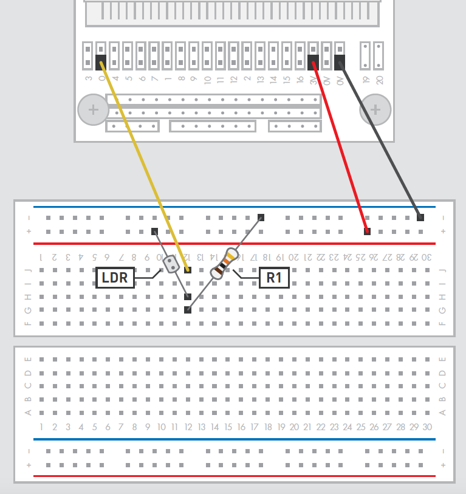
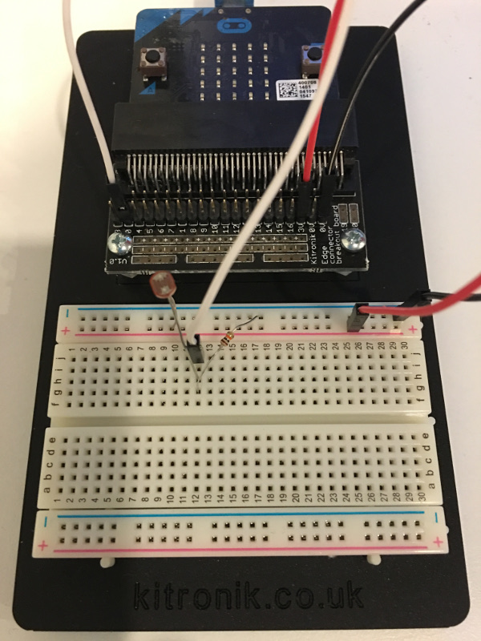

A **[light sensor](https://en.wikipedia.org/wiki/Photoresistor)** is a
small component with a particular characteristic: it is basically a
resistor and its resistance decreases if the light is more intense. To
use it with micro:bit we need to use one of the **analogic ports**. To
build this circuit you will need a **breadboard**, **3 jumper wires**, a
**10k resistance** and possibly a **[Kitronik breadboard
kit](https://www.kitronik.co.uk/5609-prototyping-system-for-the-bbc-microbit.html)**.

### The project

I wanted to realise a simple project where, depending on the light
intensity captured by the light sensor, the **micro:bit** shows an image
of the **Sun** if the light is intense and an image of the **Moon** if
the light is less intense.

Here is the complete **circuit scheme**:

[{ width=40% }](microbit_breadboard_schema_light.png)

###### "Image Copyright © Kitronik"

and here is a picture of the **finished project** I created:

[{ width=40% }](microbit_breadboard_example_2.jpg)

The **source code** I needed is available here:

and as a demo I realised this small **video**:

<iframe width="420" height="315" src="https://www.youtube.com/embed/6vLE_AQc4Bc" frameborder="0" allowfullscreen="allowfullscreen"></iframe>

