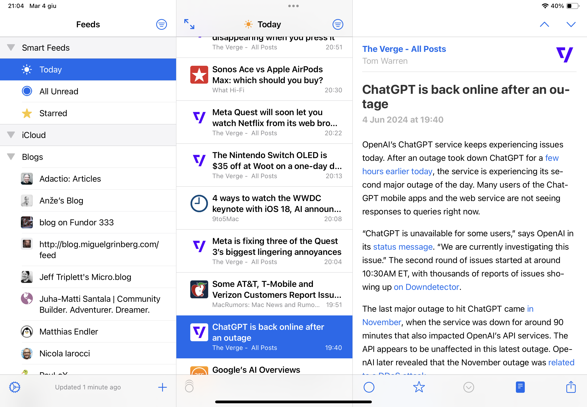

Reading news and blog posts can be quite time consuming if we manually go to news websites to check if something new is out or if we spend all day checking social media, waiting for people we follow to post their latest article.

An efficient way to fetch new content is to follow the news sites and the blogs we want, using their [RSS](https://en.wikipedia.org/wiki/RSS) feed.

What is the best way to do this for iOS and MacOS? **There is no "best" way**, since there are plenty of RSS clients and combinations of services, but I will tell you a simple and free solution I'm using.

## NetNewsWire and iCloud sync

The client I'm using is [NetNewsWire](https://netnewswire.com/). It's **free**, **open source** and available for both **iOS** and **MacOS**.

This client supports different synchronisation services, including **iCloud**, **FeedBin** and **Inoreader** or it can be used just on a single device, without using any of these services.

I initially tried using Inoreader and it was "ok", but it's a paid service which injects ads in its free plan. Also, its cheaper paid plan only removes ads, without offering any additional value. I really couldn't justify paying a subscription just to keep my feeds synced across devices, so **I opted to use iCloud** which, in my case, is exactly what I need and I don't have to purchase any additional plan (I'm already on a paid plan, but even the free plan is enough for this).

## Conclusion 

I'm sure there are better solutions around (especially RSS clients) and I would be glad to hear about them, but for now this simple client and iCloud is all I need to enjoy the news and read blog posts.
