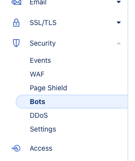
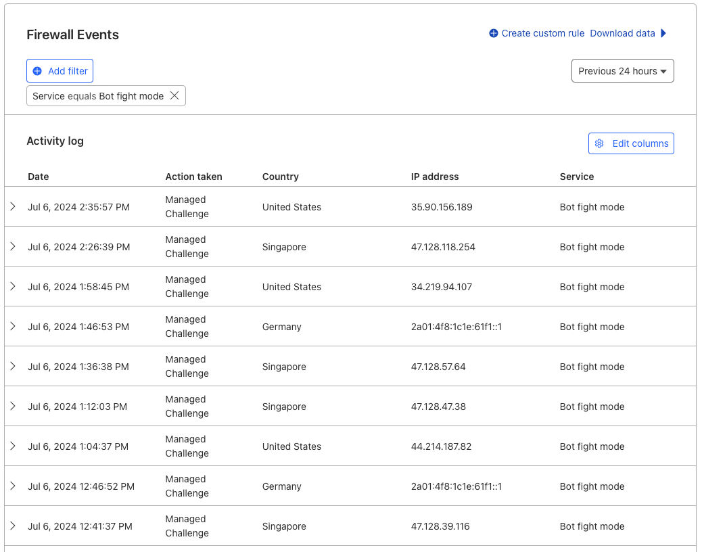
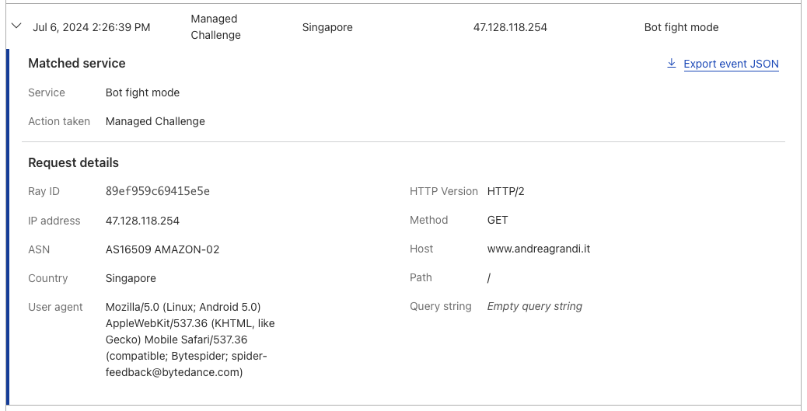

If you own a website and you don't want AI bots to crawl it and you are already using Cloudflare, you are in luck. Cloudflare has recently added a new feature that allows people to easily block AI bots from crawling their website.

## Setup

To enable this feature, you need to login to your Cloudflare account, go to the **"Security"** section and then click on the **"Bots"** link.

From there you need to enable both **"Bot Fight Mode"** and **"Block AI Scrapers and Crawlers"**.

Yes, it's that simple! And you will be happy to know that this feature is available to all Cloudflare users, even those on the **free** plan.

## Does it really work?

According to Cloudflare logs, there seem to be a lot of AI bots trying to crawl my website. Here you can see just a few of them:

In particular you can see a bot coming from Singapore and recognised as **Bytedance** (the same company that owns TikTok) which are well known for their [scraping activities](https://www.fastcompany.com/90992383/bytedance-tiktok-generative-ai-chatbot-us-regulation).

Other AI companies, like **PerplexityAI**, seem to have found a way around these blocks, because if you try to ask Perplexity to summarise one of the pages of this website, it will still be able to do it, but I'm sure that Cloudflare will soon find a way to block them too.

## Conclusion

I think people should be able to decide if they want their content to be used by AI models or not and Cloudflare is now providing an easy option to do that. AI tools are not bad per se, but they should not be built using other people's content without their **consent**.
