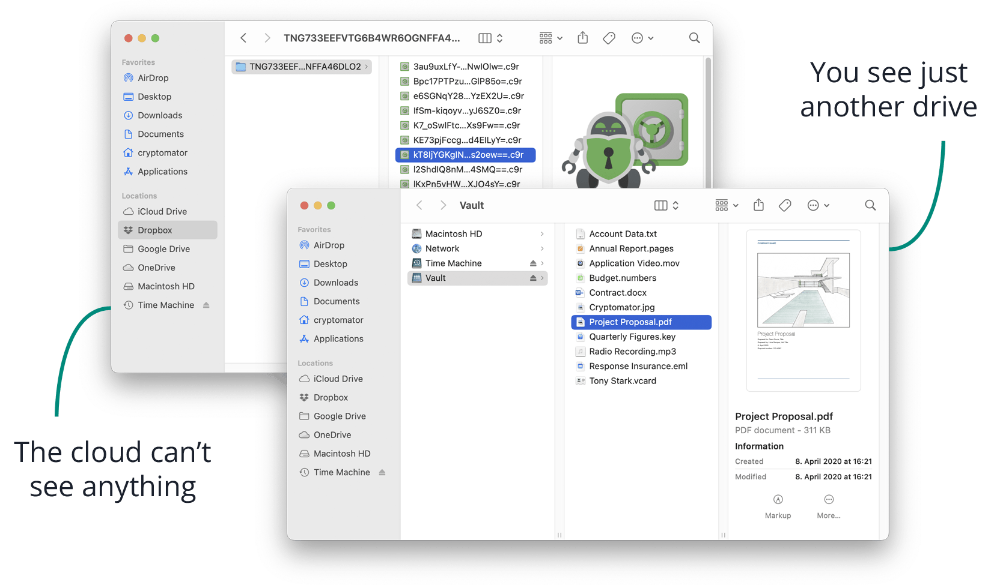

If you are using a cloud storage service like **Google Drive**, **Dropbox**, **OneDrive**, etc., you should be aware that **your files are not encrypted by default**. This means that the cloud provider is able to access and, in some cases, even share them with third parties. In case your cloud provider gets hacked, your files could also be exposed to the public.

To prevent this from happening, you can use a tool like [**Cryptomator**](https://cryptomator.org) to automatically encrypt your files before uploading them to the cloud.

## How does it work?

Cryptomator is a **free** and **open-source** software that allows you to create an encrypted vault on your computer where you can store your files. Once you have added your files to the vault, Cryptomator will encrypt them using strong encryption algorithms (256 bit AES).

To be more clear, **Cryptomator doesn't upload your files**. Your cloud provider application does:

You write files to the Cryptomator vault -> Cryptomator encrypts them and writes them in a folder which is synced up to your cloud provider -> Your cloud provider application uploads the encrypted files to the cloud.

When you want to access your files, you simply access them from your mounted vault and Cryptomator will automatically decrypt them for you.

Once the application is installed, you will see a new volume in your file manager and you will be able to work with your files as if they were on your file system. The cloud provider will only see the encrypted version of them:

## What systems are supported?

Cryptomator is available for most operating systems, including **Windows**, **MacOS**, **Linux**, **Android** and **iOS**. This means that you can use it on your desktop computer, laptop, smartphone or tablet. The only limitation is that your cloud provider must have an application for the platform you are using, so you can keep your encrypted files in sync.

I personally use it to keep my files safe on **pCloud** and I access them from my Mac, iPhone and iPad. Yes, I'm aware that pCloud has its own encryption system, but it comes at an additional cost to the user. I also think that it's safer if they don't have the encryption keys, in case they get hacked.

## How much does it cost?

Cryptomator is **free** and **open-source**, which means that you can use it without paying anything. The only application that is not free is the one for iOS, which costs a few dollars if you want to unlock all the features (for example the ability to write files), but you can still use it for free to read files (and there is a demo version available too).

## Conclusion

If you are using a cloud storage service and you want to keep your files safe and secure, you should definitely consider using Cryptomator. It is easy to use, free and open-source, and you don't have to worry about your cloud provider being 100% safe, because even if your files get leaked, they will be encrypted and no one will be able to read them without the encryption key.
