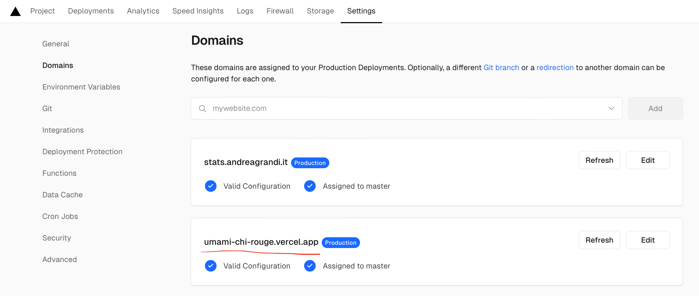
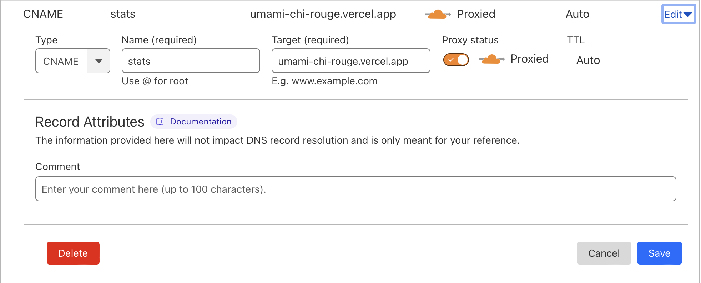
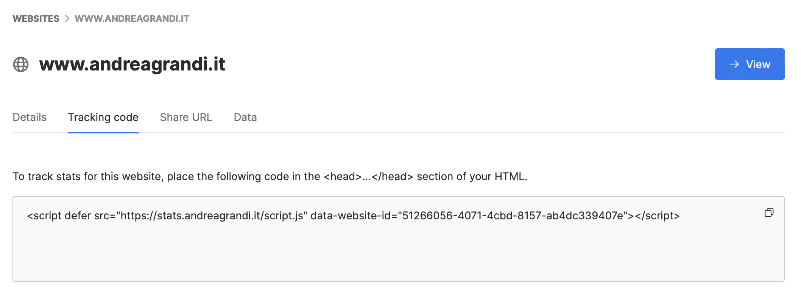

I recently started using [Umami](https://umami.is) (a **privacy first**, **GDPR compliant** solution) for this website analytics but I immediately found out that **their free plan was not enough for my needs** (10k page views per month).

Since it's completely **open source**, you can self host it anywhere you want.

I was initially evaluating between [buying a Raspberry Pi or renting a VPS](/posts/buy-or-rent-raspberrypi-vs-vps), but I eventually found a third solution which comes at **zero cost**.

## Requirements 

Your are going to need a few accounts if you want to follow exactly these steps, but keep in mind that my exact configuration is just an example and that you are free to use any other combination of services.

- [**GitHub**](https://github.com): used to login on other services and to host a fork of Umami
- [**Umami source code**](https://github.com/umami-software/umami): it's available on their GitHub account 
- [**Vercel**](https://vercel.com): used to host the app itself, they have a generous free plan
- [**Xata**](https://xata.io): they offer a very generous (15GB) free account for managed PostgreSQL
- [**Cloudflare**](https://www.cloudflare.com): this service is optional, but I found it quite useful to get a nice `stats.andreagrandi.it` which points to the deployed instance on Vercel

I won't get into every specific detail of the next steps (like "click on the second link of this page, then click..."). If you decide to self host something like this, you should have a basic understanding of how a web application works, what GitHub and a database are etc...

## GitHub 

Create a GitHub account, if you don't have one, then go to [https://github.com/umami-software/umami](https://github.com/umami-software/umami) and fork their repository into your own account.

### Fix Umami migration script

There is an existing **issue with Umami initial migration script and Xata PostgreSQL** instance. Umami tries to create an extension (which Xata already has) but Xata doesn't allow the creation of new extensions in the free plan and the returned error will make the script to fail.

To avoid this you need to comment [the first line of this migration script](https://github.com/umami-software/umami/blob/master/db/postgresql/migrations/01_init/migration.sql#L2) (by the way, I got in touch with Xata support too and they mentioned they could eventually avoid returning an error in this case but I don't have an estimate on when this will be done).

## Xata

Before you create the account on Vercel, I suggest you to create the Xata account. You will need the PostgreSQL connection string at hand during Vercel configuration, so it's better to create it upfront.

You can use the GitHub account to login to Xata, then create a new database and select the **"Enable direct access to Postgres"** option.

Xata **free plan** allows you to have a database where **you can store up to 15GB of data**.

Finally copy the connection string in a safe place, you will need it later.

### Connections limit

Since we are here, I suggest you also add `connection_limit=10` to the connection string, otherwise you risk to saturate all the available connections in the free plan.

```bash
postgresql://abc123:<YOUR_API_KEY>@eu-central-1.sql.xata.sh/umami:main?sslmode=require&connection_limit=10
```

## Vercel

[Vercel](https://vercel.com) is an hosting service which allows you to run web applications in a **completely managed environment**. You won't have to think about OS upgrades, manually install any framework or think about security. Everything will be managed and all the options can be adjusted from a web interface.

The company behind it is the same behind [**NodeJS**](https://nodejs.org).

1. Create an account using GitHub login, so you won't have to use a specific user/password to login.
2. Import the fork: in my case it's the one at [https://github.com/andreagrandi/umami](https://github.com/andreagrandi/umami)
3. Configure the project adding the PostgreSQL connection string: you can find this in the Xata dashboard.
4. Test the connection and do the first deployment.

## Umami

Once the deployment is completed, **Umami should be up and running** at the address specified here:



At this point you need to change the default password as soon as possible. Login using `admin` and `umami` and then go to the settings page to change it.

## Cloudflare

In case you already use Cloudflare (I don't suggest you go through a configuration from scratch just to have a nice url), I will show you what I did to have my stats running on `stats.andreagrandi.it`

To do this, you need to create a new CNAME record in your Cloudflare dashboard, pointing to the Vercel deployment url, like I did here:



Once the record has been created, you need to go back to Vercel and add the new domain to the project settings (see the previous screenshot), so that the application will be reachable from the new domain.

## Complete the configuration

The rest of the instructions are just about configuring the website and adding the analytics snippet to your website. I won't go into details here, but you can find all the information you need in the [official Umami documentation](https://umami.is/docs).

### Add a website

The first thing you have to do once you login to Umami is to add a new website. You can do this by clicking on "Settings" first, then "Websites" link in the left menu and then on the "Add website" button. You can find the complete instructions [here](https://umami.is/docs/add-a-website).

### Install the analytics snippet to your website

Then you need to copy the tracking code and add it to your website. You can find the complete instructions [here](https://umami.is/docs/collect-data). How to do this depends on the technology you are using to build your website, but in general it must be placed inside the `<head>` tag of your website.



## Conclusion

If you are looking for a privacy first, GDPR compliant analytics solution, you should definitely consider Umami. It's easy to use, free and open-source, and you don't have to worry about your data being shared with third parties. You can host it yourself and have full control over your data.
