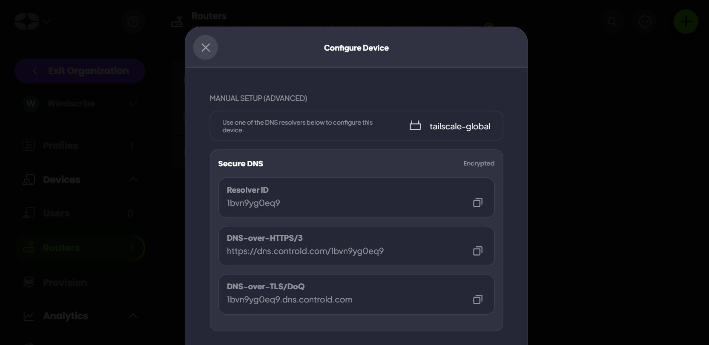
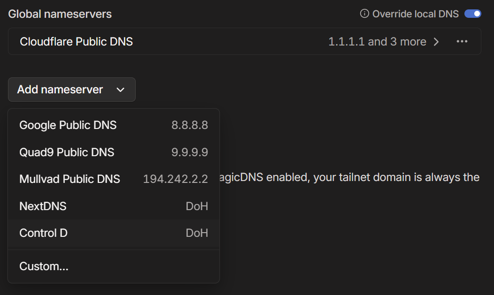
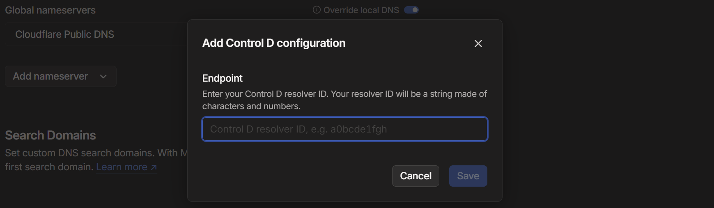
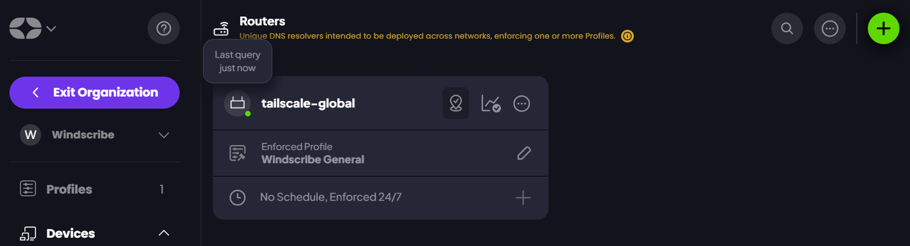

If you are using [**Tailscale**](https://tailscale.com) in some of your devices, you also need to use Tailscale own DNS server to resolve the names of the devices in the network. If you are also a user of [**ControlD**](https://controld.com) DNS, and you want to use it with Tailscale, you can finally do it!

## Configure a new Endpoint on ControlD

First of all, you need to create a new **endpoint** on ControlD. You can do it by logging in to your ControlD account, select **Endpoints** from the left menu, and then click on the plus button.

Scroll down to **Router** section and select **Other** as the device type. In the next screen you need to specify a name, I used `tailscale-global` but you can use any name you want.

Once you have created it, take note of the **Resolver ID**, because you will need it in the next step.

## Configure the DNS on Tailscale

At this point you need to go to [Tailscale admin console](https://login.tailscale.com/admin/dns), and select the **DNS** tab. Click on the **Add nameserver** menu, and select "Control D" from the list.

Once you have selected **ControlD** from the list, you will get this window and you will need to fill the **Endpoint** using the **Resolver ID** you got from the previous step.

Now you can click on the **Save** button.

## Verify the configuration is working

The configuration is done! If you already have some devices connected to your Tailscale network, you will be able to check if the configuration is working by checking the endpoints visible in the ControlD dashboard: [https://controld.com/dashboard/endpoints](https://controld.com/dashboard/endpoints)

If you see a **green dot** next to the router icon, it means the endpoint is in use and the configuration is working.

## References

- [Tailscale Documentation](https://tailscale.com/kb/1403/control-d)
- [ControlD Documentation](https://docs.controld.com/docs/tailscale-integration)
