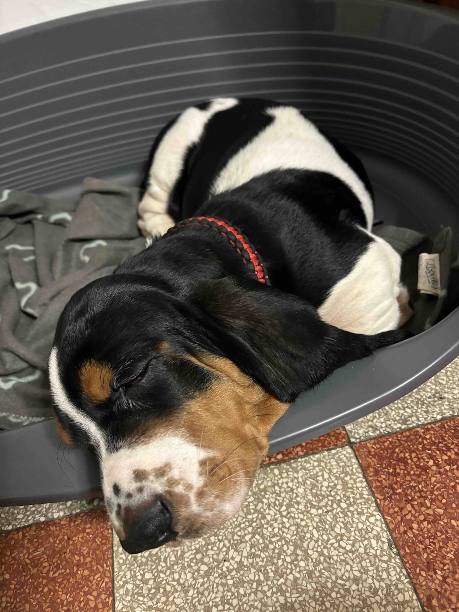

I've always wanted a dog (actually... my family had one ~30 years ago, but since I wasn't directly involved with him, I never felt him as my own). Life (and sometimes laziness) had not allowed me to own one in the past (living abroad, moving back to
Italy but living in a small apartment etc...) so when I finally had the chance, I got him!

His name is **Fulvio** and he's a **[Basset Hound](https://en.wikipedia.org/wiki/Basset_Hound)** breed (yes, the same breed as [**Lieutenant Columbo**](https://en.wikipedia.org/wiki/Columbo_(character)) one 😅)

Since I got him, **my life has definitely changed**. Mostly for **good things** (like doing a **45-50 minutes walk every morning** which is helping me a lot to be more healthy!) but there are definitely things I still need to get used to 🥲

I'm lucky to have 3 weeks off for this Christmas holidays and this means plenty of time to play with him and to get to know each other.

I don't have much else to say, so I will leave you with another picture of him.

Greeting from me and Fulvio! 👋 🐶

