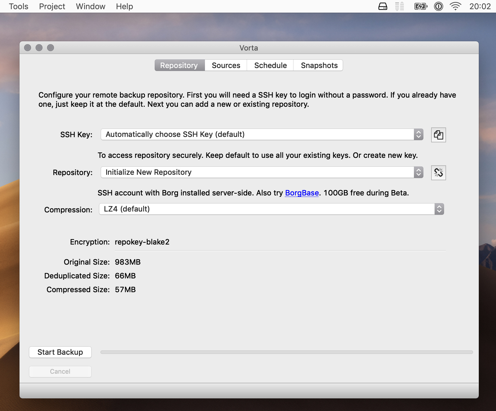
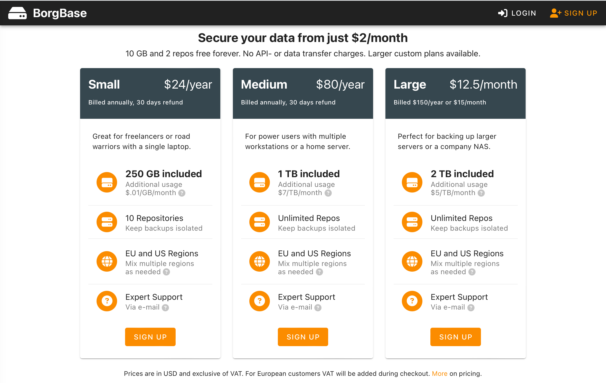

Recently I reviewed my backup strategy and started using a new open source software and a cloud service to keep my data safe.

Before this my only backup was keeping my data in the cloud (specifically I use pCloud), but I started thinking: what if they shut down? What if I loose access to my account?

This convinced me to have an additional copy of my data. 

Actually two additional copies: a local one, on an **USB disk**, which is of course not reliable (disks can and will break!), but it's fast if I need to recover something and a remote one, on a **dedicated cloud service**, which is of course slower but quite reliable (you pay for your data to be kept safe).

## My personal requirements 

Requirements can be different from person to person, but in this case I think they are quite common sense.

The first thing I want from a backup solution is that it is **encrypted** and that I will be the only one having the encryption keys.

The second requirement is that the backup is **incremental**. This means that if I do a new backup every day, I expect the new backup to only contain the data which changed from the previous one.

The third requirement is that the backup can be **automated**. I don’t want to have to remember to backup my data, I want it to happen automatically.

In addition to the above, I have a strong preference for solutions which are **open source** and possibly **free**.

## BorgBackup

The solution which matches all the above requirements is **[BorgBackup](https://www.borgbackup.org)**.

I won't spend time to explain how to install it, because the official documentation is very well made.

I also won't spend time to explain how to configure it, because that's not how I used it.

Borg is a command line software and using and configuring it is not straightforward, that's why I immediately looked for a UI.

## Vorta

Here comes **[Vorta](https://vorta.borgbase.com)**. As I mentioned before, while Borg has all the features I need, unfortunately it's not easy to use and configure. A command line utility is a must if you are backing up a remote server, but it's not really user friendly for desktop usage.

Vorta allows you to **easily configure a new backup**. All you have to do is **create** a new **repository**, set a **password**, **select** the files and folders you want to backup and decide from manual backup and regularly **scheduled** one.

Optionally (but I strongly suggest you do it) you can flag a couple of options which will verify the **backup integrity** regularly.

In case you need to recover your files, you just have to select an existing archive and a folder on your laptop which will be used to mount the volume. At this point you will be able to **access your files** from the operating system **file manager**.

## BorgBase

**[BorgBase](https://www.borgbase.com)** is a service which provides **hosted repositories** for Borg backup.

They have three commercial plans, starting **from $2/month for 250 GB** (which is the plan I have) but they also offer a **free plan with 10 GB** included, so you can test the service as much as you want.

The same people also develop Vorta, so if you pay for the service you are also making sure the project remains funded.

## Conclusion

As you can see, configuring a good backup solution is not that difficult nor expensive. Remember the best day to start backing up is yesterday and today is still better than tomorrow 😉

