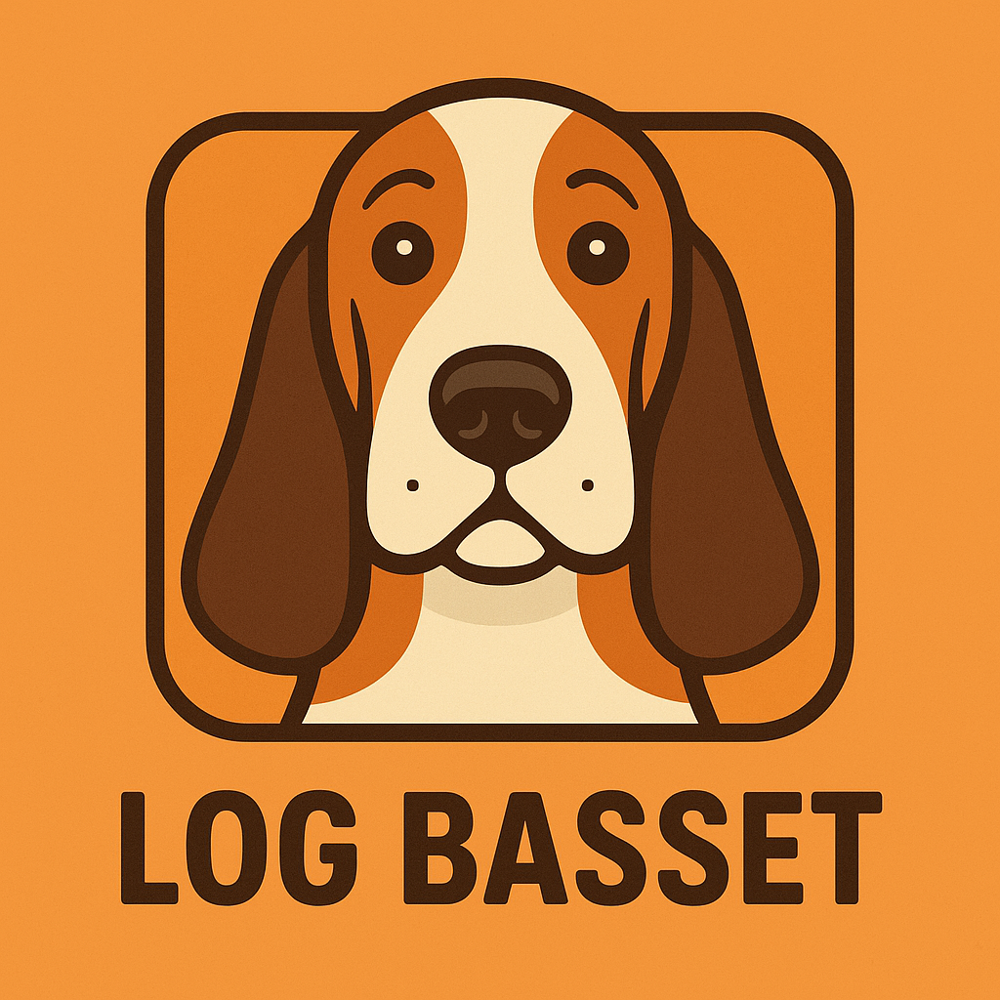

## Introduction



At work, we use **Scalyr** to access our logs. They provide a web interface and a [client](https://github.com/scalyr/scalyr-tool) written in Python, but it hasn't been updated in the last couple of years, and I'm not sure if it's abandoned.

As CLI coding agents become more popular, it's important to have reliable CLI tools for accessing various services.

[**Log Basset**](https://github.com/andreagrandi/logbasset) is a CLI tool for accessing Scalyr logs, written from scratch in Go.

## Why Log Basset?

There are a few reasons why I decided to rewrite their tool in Go:

- I wanted to have fun 🙂
- A tool written in Go is easier to distribute and use (no need to set up a virtual environment)
- I was curious to stress test [**OpenCode**](https://opencode.ai) and `sonnet-4`

Yes, this tool was mostly written using AI tools. If that's a problem for you, please do not use it.

## Key Features

Log Basset maintains most of the original features, but I focused on the "read-only" ones. In particular, you can:

- **query**: Retrieve log data
- **power-query**: Execute PowerQuery
- **numeric-query**: Retrieve numeric/graph data
- **facet-query**: Retrieve common values for a field
- **timeseries-query**: Retrieve numeric/graph data from a timeseries
- **tail**: Provide a live 'tail' of a log

Compared to the original version, it also offers:

- Flexible time formats and output types
- Strong input validation
- Multi-layer configuration
- Cross-platform support and high performance

## Installation

You can either use one of the packages from the GitHub [release page](https://github.com/andreagrandi/logbasset/releases) or:

### Homebrew (macOS/Linux)

```bash
brew tap andreagrandi/tap
brew install logbasset
```

### From Source

```bash
git clone https://github.com/andreagrandi/logbasset
cd logbasset
make build
```

## Usage Examples

Once you have set your API key like this:

```bash
export scalyr_readlog_token='your-api-token-here'
```

You can query logs like this:

```bash
# Display the last 10 log records
logbasset query

# Display the last 100 log records, showing only timestamp, severity, and message
logbasset query --count=100 --columns='timestamp,severity,message'

# Display the first 10 log records beginning at 3:00 PM today, from host100
logbasset query '$serverHost="host100"' --start='3:00 PM'

# Display the last 1000 entries in CSV format
logbasset query '$source="accessLog"' --output=csv --columns='status,uriPath' --count=1000
```

Or tail them:

```bash
# Display a live tail of all log records
logbasset tail

# Display a live tail from a specific host
logbasset tail '$serverHost="host100"'

# Display live tail with full record details
logbasset tail --output multiline
```

A complete guide is available in the [project readme](https://github.com/andreagrandi/logbasset/blob/master/README.md).

## Conclusion

Log Basset is my attempt to make working with Scalyr logs a bit easier and more enjoyable. If you give it a try and have feedback or ideas, let me know—or even better, open an issue or PR on GitHub!
