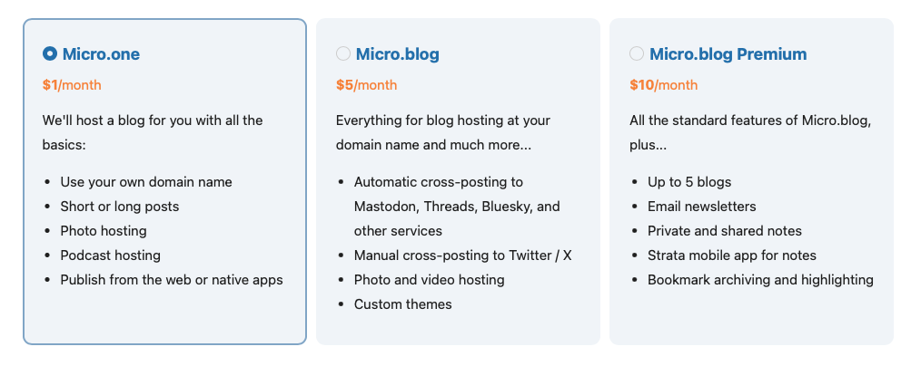

I found out about **[Micro.blog](https://micro.blog)** platform thanks to **[Jeff Triplett](https://mastodon.social/@webology)** a few
months ago and I even decided to give it a try, but to be honest, having already a main blog, made with [Hugo](https://gohugo.io), which is hosted for free on [GitHub Pages](https://pages.github.com), I couldn't really justify spending another **$5/month** for a micro blogging platform.

## Micro.one

Then [Manton Reece](https://www.manton.org/about/) (the creator of Micro.blog) announced (actually he didn't do it officially when I discovered it, but I found out anyway!) a new plan: **Micro.one**

For **just $1/month** (or $10/year if you switch to the annual plan!) I can have my micro blog hosted, with custom domain support, I can post text, photos and even podcasts!

## What is Micro.blog?

Micro.blog (and Micro.one too) is an hosting solution for static blogs. The user selects a template, creates the content and the platform uses Hugo to create the pages which are then published.

Nothing revolutionary for me, but I reckon this is a **quite good solution** for many people who would like to have a blog but they don't have the skills to use Hugo or create a CI jobs which publish to GitHub Pages.

## Why a micro blog?

I often have content to post which is too short to justify a proper blog post but it's too long to be posted on **Mastodon** or **BlueSky**. For this type of posts, Micro.blog is perfect!

## Conclusion

If you are looking for an easy to use solution to create a personal blog, look no further. Oh, and you can **visit mine** at this address: [https://micro.andreagrandi.it](https://micro.andreagrandi.it)