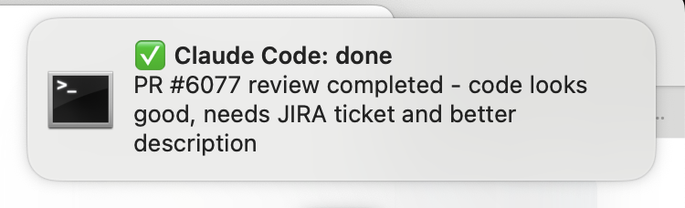

## Introduction

When working with Claude Code on macOS, you might find yourself waiting for long-running tasks to complete or missing important prompts for user input. The `terminal-notifier` utility provides an elegant solution by sending desktop notifications directly from the command line, helping you stay informed about your Claude Code sessions even when you're focused on other tasks.

**Note:** I decided to use `terminal-notifier` both because I can customise the notification I receive and also because my setup was having issues and I didn't always get notifications from my terminal.

## What is terminal-notifier?

`terminal-notifier` is a command-line tool for macOS that allows you to send user notifications from the terminal to the Notification Center. It's particularly useful for automation scripts and development workflows where you need to be alerted about specific events.

## Installing terminal-notifier

The easiest way to install `terminal-notifier` is through Homebrew:

```bash
brew install terminal-notifier
```

## Using terminal-notifier with Claude Code

Claude Code can be configured to use `terminal-notifier` for sending notifications in different ways. The most realiable (and deterministic)
would be using the new `/hooks` feature, but honestly I couldn't make it work.

The other method (which works for me, but I warn you that is not deterministic - ie: it depends on the intepretation of the model)
is to add instructions to your global or project-specific `CLAUDE.md` file:

```markdown
## Notification

- IMPORTANT: YOU MUST ALWAYS DO THIS: When you need to send me a notification because you need input or when you have finished a task, please use terminal-notifier tool like this: terminal-notifier -title "🔔 Claude Code: request" -message "Claude needs your permission to use ...", or terminal-notifier -title "✅ Claude Code: done" -message "The task has been completed"
- Always customise the message using a short summary of the input needed or the task just completed
```

Save the file and start a new Claude Code session.

## Final result

If everything worked, once Claude has finished elaborating a task, you should get a notification like this:



## Troubleshooting

### Notifications Not Appearing

1. Check that notifications are enabled for Terminal in System Preferences > Notifications
2. Ensure `terminal-notifier` is properly installed and in your PATH
3. Try running a test notification manually to verify functionality: `terminal-notifier -title "Hello" -message "World!"`

## Conclusion

Integrating `terminal-notifier` with Claude Code creates a more efficient and responsive development workflow. By receiving timely notifications about task completion and input requests, you can maintain focus on other work while staying connected to your Claude Code sessions.

The combination of Claude Code's automation capabilities with macOS's native notification system provides a seamless development experience that keeps you informed without being intrusive.
