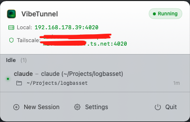
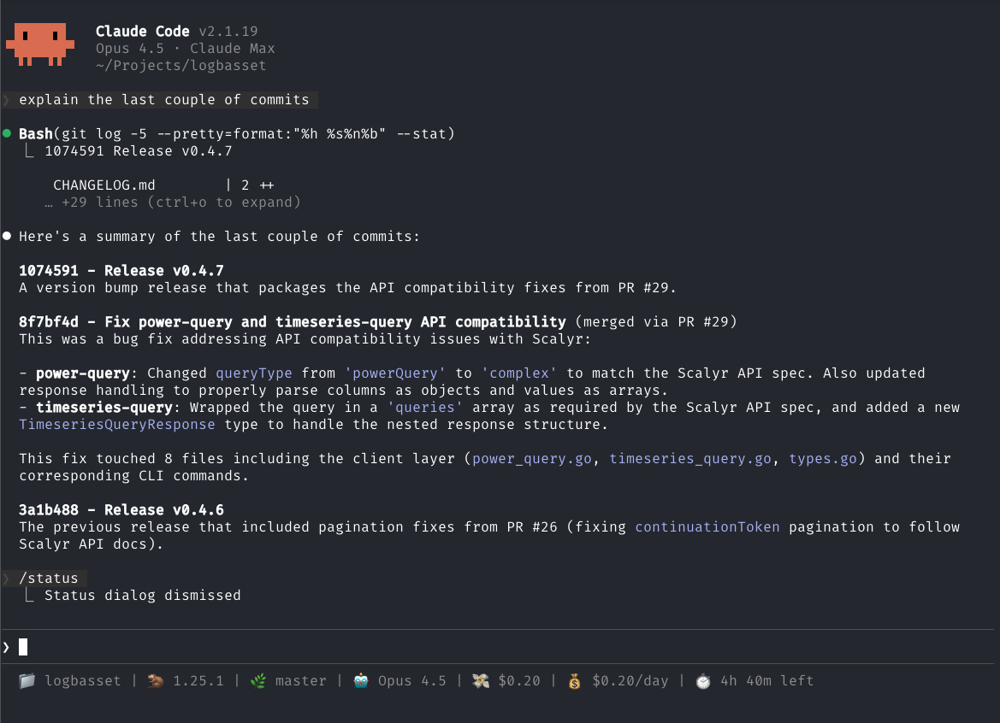
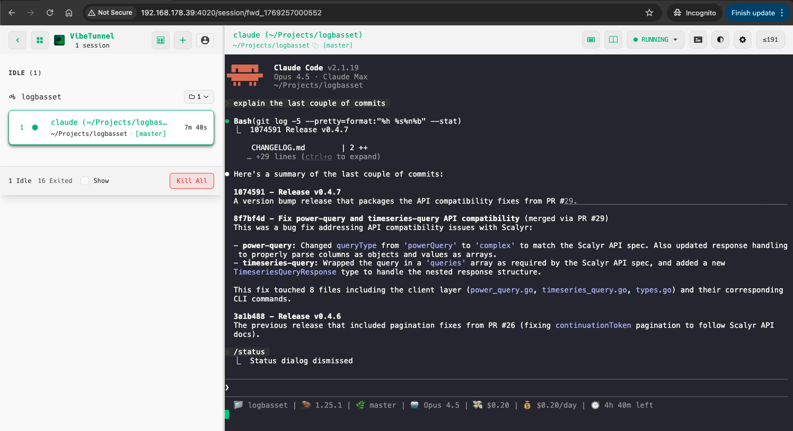

## Introduction

If you work with **Claude Code** regularly, you know how useful it can be to have multiple instances running on different machines. But what happens when you're away from your desk and need to check on a long-running task or provide input to your agent?

[**VibeTunnel**](https://vibetunnel.sh/) solves this problem by exposing your Claude Code terminal sessions through a web interface, allowing you to control them remotely from any browser.

## What is VibeTunnel?

VibeTunnel is a tool that transforms your browser into a functional terminal interface, enabling remote command execution with minimal setup. It runs as a server on your machine and provides a web dashboard where you can view and interact with active terminal sessions.

On MacOS, it also comes with a menu bar application that shows the status of your tunnels and gives you quick access to open any active session in your browser.

[](vibetunnel_status.png)

## Some Use Cases

There are several scenarios where VibeTunnel shines:

- **Long-running tasks**: Start a complex refactoring or code generation task before leaving your desk, then check on its progress from your phone or another computer
- **Multi-machine workflows**: Control Claude Code instances running on your home workstation from your laptop at a coffee shop
- **Team collaboration**: Share your terminal session with a colleague to debug an issue together
- **On-call scenarios**: Respond to production issues by accessing your development environment from anywhere

## How to Install and Configure It

### Installation

On **MacOS** (Apple Silicon, MacOS 14.0+), you can install VibeTunnel via Homebrew:

```bash
brew install --cask vibetunnel
```

After installation, launch the application from your Applications folder. You'll see a new icon appear in your menu bar.

Alternatively, on **any platform** with Node.js 22.12+, you can install it via npm:

```bash
npm install -g vibetunnel
```

Or run it directly without installation:

```bash
npx -y vibetunnel --no-auth
```

### Usage

Once VibeTunnel is running, you use the `vt` command to wrap any terminal command you want to monitor remotely. For Claude Code:

```bash
vt claude
```

This will start Claude Code as usual, but now it's accessible through the web interface at `http://localhost:4020`. The menu bar icon will update to show the active session.

[](claude_terminal.png)

You can then open the dashboard in your browser to view and interact with your session:

[](claude_from_browser.png)

If you need to bind to a network interface for remote access:

```bash
vibetunnel --bind 0.0.0.0
```

## Not Just Claude Code

While I've focused on Claude Code in this post, VibeTunnel works with any terminal application. You can use it to remotely control:

- **Other AI coding agents**: Gemini CLI, OpenAI Codex, Aider, or any other agent that runs in the terminal
- **Interactive shells**: Start a full zsh or bash session with `vt --shell` and have remote access to your entire development environment
- **Long-running scripts**: Monitor build processes, test suites, or deployment scripts from anywhere
- **Development servers**: Keep an eye on your local dev server logs while away from your desk

```bash
# Start Gemini CLI
vt gemini

# Start an interactive shell session
vt --shell

# Run and monitor a build
vt npm run build

# Watch test output
vt pytest -v
```

Essentially, if it runs in a terminal, you can wrap it with `vt` and access it remotely.

## Using Tailscale to Make Instances Reachable from Everywhere

By default, VibeTunnel only exposes your sessions on localhost. To access them from anywhere, you can combine it with [**Tailscale**](https://tailscale.com/).

Tailscale creates a secure, private network between your devices. Once you have it set up:

1. Install Tailscale on your development machine and any device you want to access it from
2. Make sure both devices are connected to your Tailnet
3. Start VibeTunnel with network binding: `vibetunnel --bind 0.0.0.0`
4. Access your VibeTunnel dashboard at `http://[your-tailscale-hostname]:4020`

This way, you can securely access your Claude Code instances from your phone, tablet, or any other computer, regardless of where you are in the world.

## What Could Be Improved

While VibeTunnel is a useful tool, there are a few areas where it could be better:

- **Mobile usability**: The web interface works on mobile browsers, but it's not optimised for smaller screens. Typing commands and reading output on a phone can be awkward
- **Touch interface**: Terminal interactions don't translate well to touch, making it difficult to do anything beyond basic monitoring on mobile devices

If mobile access is a priority for you, you might want to check out [**Happy**](https://happy.engineering/) as an alternative. It provides a more mobile-friendly interface for interacting with your coding agents remotely (but it is more limited in terms of features and compatibility, ie using /commands etc...)

## Conclusion

VibeTunnel is a handy tool for anyone who wants more flexibility in how they interact with Claude Code. Combined with Tailscale, it opens up the possibility of truly remote development workflows.

While the mobile experience could use some polish, it's already useful for monitoring long-running tasks and occasionally providing input when you're away from your main machine.

If you give it a try, I'd be curious to hear about your experience!
