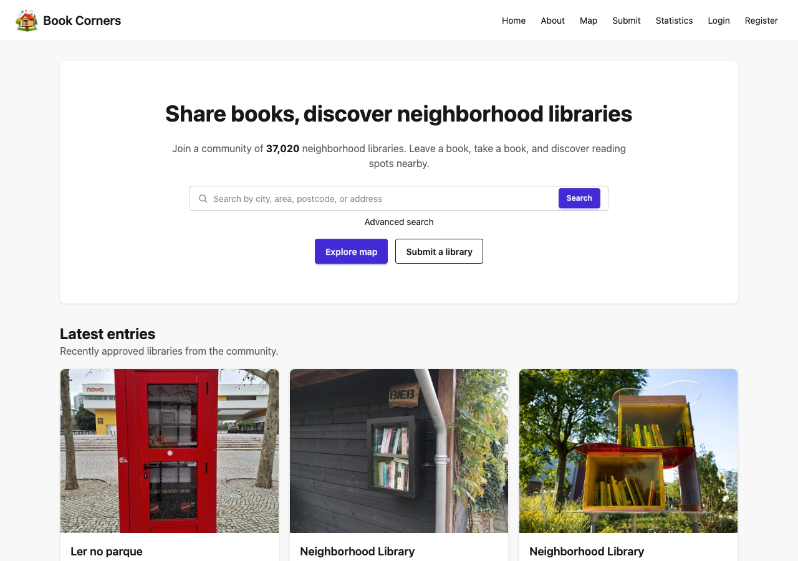
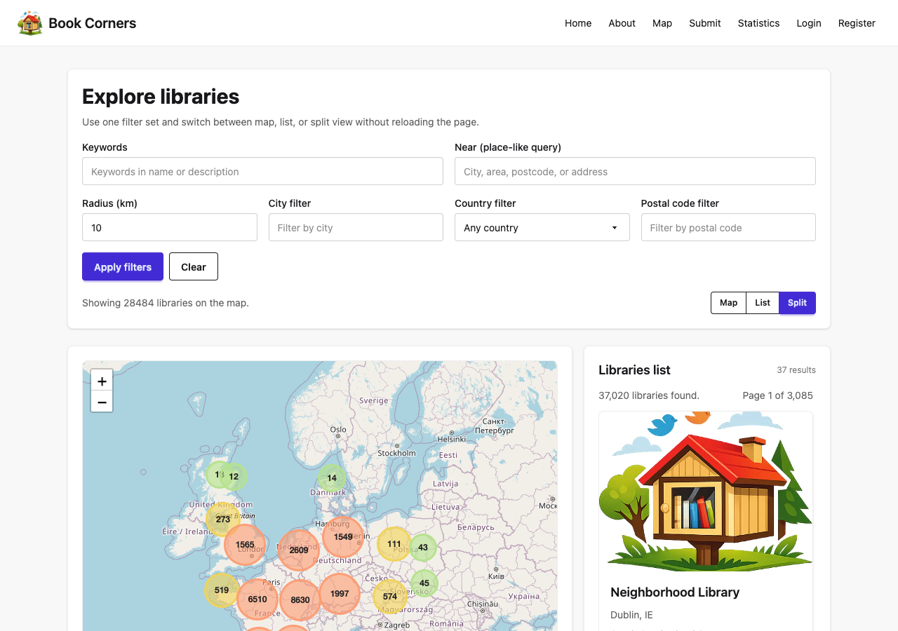
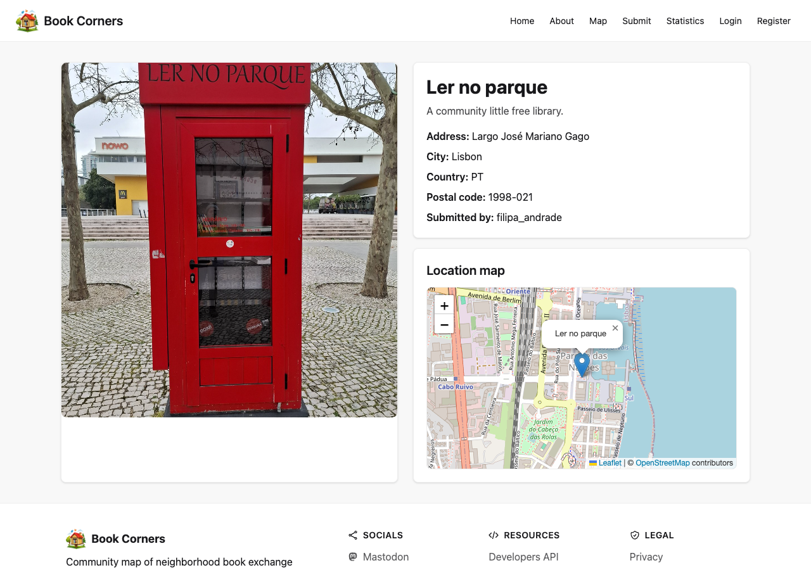

## Introduction

If you've ever walked around a neighbourhood and stumbled upon a small wooden box full of books, you know the feeling: a mix of curiosity and warmth. These little free libraries are scattered across cities and towns everywhere, yet there was no easy way to find them or share new ones you discover.

I've always been a book lover, and after spotting a few of these gems near my home, I started wondering: how many more are out there? Is there a place where people can map them and help others find them? I couldn't find anything that really worked well, so I decided to build one myself.

## What is Book Corners?

[**Book Corners**](https://www.bookcorners.org/) is a community-driven platform to discover, map, and contribute little free libraries from all over the world. Think of it as a collaborative map where anyone can browse existing libraries, submit new ones, and contribute photos.

At the time of writing, the platform already lists over **37,000 libraries** across multiple countries. Most of the initial data was imported from [**OpenStreetMap**](https://www.openstreetmap.org/), and the number keeps growing thanks to community contributions.

## Browsing and Discovering Libraries

The core experience is the **interactive map**. You can explore libraries visually, with markers clustered by density so it doesn't become overwhelming. Zooming in reveals individual locations, and clicking a marker shows a quick preview with the library's name and photo.

If you prefer a more targeted approach, there's a **search** feature: you can look up libraries by city, area, postcode, or address. There are also filters by country, city, and postal code, and you can switch between map, list, or split view depending on how you like to browse.

## Adding a New Library

Found a little free library that's not on the map? You can submit it in just a few steps. Take a photo, upload it, and if your photo has GPS data embedded (most phone cameras do), the location will be extracted automatically. Otherwise, you can simply click on the map to set the exact position, and the address fields will be filled in for you. Once submitted, it goes through a quick review before appearing on the map.

## Each Library Has Its Own Page

Every library on the platform has a dedicated detail page showing its photo, address, a small location map, and any additional details. Community members can also contribute extra photos and report issues (like a damaged or missing library), helping keep the information accurate and up to date.

## Follow Us

New libraries are automatically shared on our social channels, so following us is a great way to discover interesting reading spots from around the world:

- [Mastodon](https://mastodon.social/@bookcorners)
- [Bluesky](https://bsky.app/profile/bookcorners.org)
- [Instagram](https://www.instagram.com/bookcornersorg/)

## Contributing

Book Corners is an **open source** project and it thrives on community contributions. There are many ways you can help:

- **Add missing libraries**: if you know of a little free library that's not on the map yet, submit it! It only takes a minute.
- **Contribute photos**: visit a library detail page and add your own pictures. Many libraries in the database still don't have a photo.
- **Report issues**: if something is wrong or a library no longer exists, use the report feature to let us know.
- **Contribute code**: the project is fully open source on [GitHub](https://github.com/andreagrandi/book-corners). Whether it's a bug fix, a new feature, or a translation, pull requests are always welcome.

## What's Next

This post was meant to give you an overview of what Book Corners is and how to use it. In a follow-up post I'll go into the technical details of how it was built and implemented, from the tech stack to the architecture decisions. Stay tuned!

In the meantime, head over to [bookcorners.org](https://www.bookcorners.org/), explore the map, and maybe add a library you know about. Every contribution helps build a better resource for book lovers everywhere.
