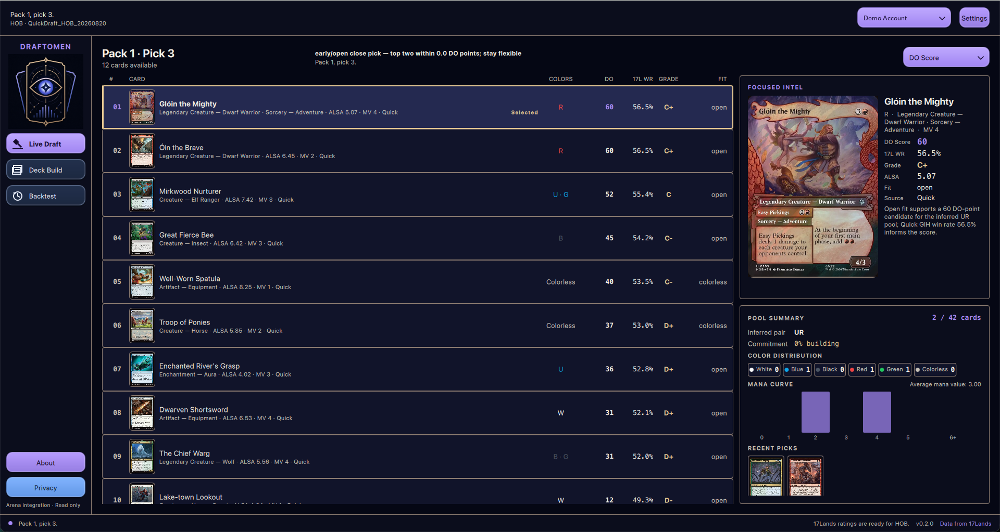
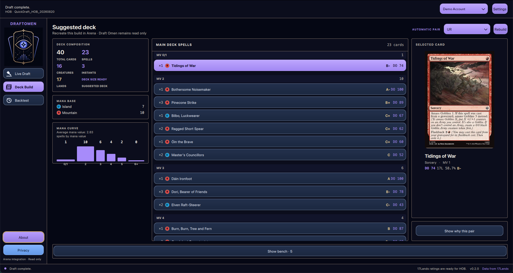

## What is Draft Omen

I like drafting on MTG Arena, but I am not great at remembering which commons are actually good in a new set. So I built [Draft Omen](https://www.draftomen.com/), a desktop app that sits next to Arena while you draft and tells you which cards in the pack are worth taking.

It reads Arena's local `Player.log`, works out which pack and pick you are on, and ranks the cards in front of you. When the draft is over, it suggests a 40-card deck from your pool. You can still take whatever card you want. The app only shows you the numbers behind each pick.

Draft Omen is read-only. It never writes to Arena, injects anything into it or clicks for you. It runs on macOS and Windows, and the source is on [GitHub](https://github.com/andreagrandi/draftomen).

## Picking cards

Each card in the pack gets a DO Score from 0 to 100, together with its 17Lands win rate, a letter grade and how well it fits the colors you have drafted so far. Early picks stay open. From pick 6 the app starts to favour cards in your colors, so it doesn't tell you to take a random off-color rare in pack 3.

If you don't trust the DO Score, you can sort the pack by raw 17Lands win rate, ALSA or mana value instead.

## Building the deck

When the last pick is done, Draft Omen picks the best two-color pair for your pool and builds a 40-card deck. It looks at card quality, the curve, the number of creatures and the mana you need. It can also suggest a small splash when a bomb is worth it.

## Supported drafts

Draft Omen follows four Arena formats:

- Quick Draft
- Premier Draft
- Traditional Draft
- Pick-Two Draft

It reads the format from the event name, so you don't have to set anything before you join.

## Drafting on Moxgate

Arena is not the only place to draft. Draft Omen also works with [Moxgate](https://www.moxgate.com/). A small Chrome extension reads the pack and your pool from the Moxgate page and sends them to Draft Omen on your own computer. The extension only talks to `127.0.0.1` and doesn't contact any other server. Choose Moxgate as the draft source in the app and you get the same recommendations you would get on Arena.

## Mocked drafts with Draftmancer

Testing a draft assistant by playing real drafts costs gems, and it is slow. So Draft Omen can run a mocked draft locally using [Draftmancer](https://draftmancer.com/), an open source draft simulator. You draft against bots in a Quick or Pick-Two pod, either picking cards yourself or letting the app pick on its own, and you get the same deck builder at the end. For now it is a developer feature. You need a local Draftmancer checkout and Node.js, and you turn it on from the developer section in Settings. Once it runs, it is also a nice way to practise a new set without spending anything.

## Where the data comes from

- Card details and images come from [Scryfall](https://scryfall.com/).
- Win rates and other draft statistics come from [17Lands](https://www.17lands.com/).

Draft Omen downloads both and caches them, so ratings from your last session are ready as soon as you open the app. If 17Lands has no data for the format you are playing yet, it falls back to Premier Draft data and marks those ratings with a `*`.

## Try it

On Windows you can install Draft Omen from the [Microsoft Store](https://apps.microsoft.com/detail/9NPCD3VLZQMX). On macOS, download the DMG for your Mac from the [GitHub releases](https://github.com/andreagrandi/draftomen/releases/latest). Before your first draft, turn on **Detailed Logs (Plugin Support)** in Arena under Settings, Account, then restart Arena.

If you find a bug or have an idea, open an issue on [GitHub](https://github.com/andreagrandi/draftomen/issues). See you in the draft queue.

*Draft Omen is unofficial Fan Content permitted under the Fan Content Policy. Not approved or endorsed by Wizards of the Coast, Scryfall or 17Lands.*
